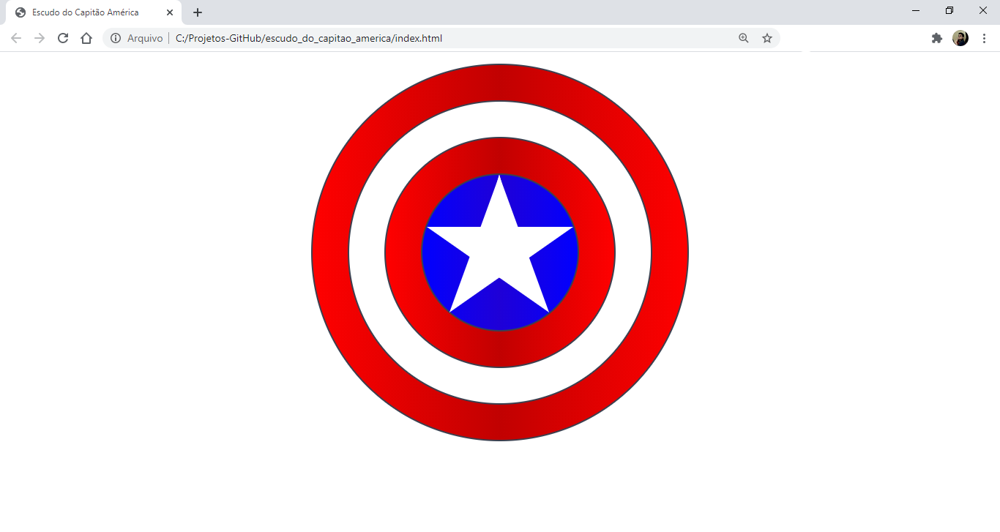

<div align="center" id="top"> 
  

  &#xa0;

  <!-- <a href="https://escudo_do_capitao_america.netlify.app">Demo</a> -->
</div>

<h1 align="center">Escudo do Capitao América</h1>

<p align="center">
  

  

  

  

  <!--  -->

  <!--  -->

  <!--  -->
</p>

<!-- Status -->

<!-- <h4 align="center"> 
	🚧  Escudo_do_capitao_america 🚀 Under construction...  🚧
</h4> 

<hr> -->

<p align="center">
  <a href="#dart-about">About</a> &#xa0; | &#xa0; 
  
  <a href="#rocket-technologies">Technologies</a> &#xa0; | &#xa0;
  <a href="#white_check_mark-requirements">Requirements</a> &#xa0; | &#xa0;
  <a href="#checkered_flag-starting">Starting</a> &#xa0; | &#xa0;
  <a href="#memo-license">License</a> &#xa0; | &#xa0;
  <a href="https://github.com/{{YOUR_GITHUB_USERNAME}}" target="_blank">Author</a>
</p>

<br>

## :dart: About ##

Escudo do Capitão América feito em CSS 

<!--  ## :sparkles: Features ## -->

<!-- :heavy_check_mark: Feature 1;\ -->
<!-- :heavy_check_mark: Feature 2;\ -->
<!-- :heavy_check_mark: Feature 3; -->

## :rocket: Technologies ##

The following tools were used in this project:

- HTML 5
- CSS

## :white_check_mark: Requirements ##

Before starting :checkered_flag:, you need to have [Git](https://git-scm.com) installed.

## :checkered_flag: Starting ##

```bash
# Clone this project
$ git clone https://github.com/FelipeFerreiraSS/escudo_do_capitao_america

# Access
$ cd escudo_do_capitao_america

```

## :memo: License ##

This project is under license from MIT. For more details, see the [LICENSE](LICENSE.md) file.


Made with :heart: by <a href="https://github.com/FelipeFerreiraSS" target="_blank">Felipe Ferreira</a>

&#xa0;

<a href="#top">Back to top</a>
